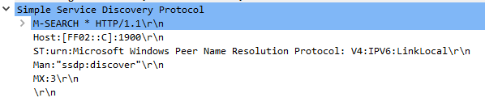
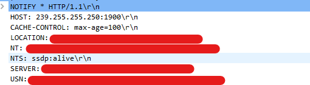

# Протокол SSDP
__Выводы делаются на основании пакетов, перехватываемых Wireshark__

__Simple Service Discovery Protocol__ - протокол для обнаружения сетевых сервисов в локальной сети.
Немного о нем есть на [Википедии](https://en.wikipedia.org/wiki/Simple_Service_Discovery_Protocol). Здесь мы будем рассматривать его на практике

Протокол построен на основе __HTTP__, так же является текстовым, но для транспорта использует __UDP__

Для поиска сервисов протокол использует _мультикаст адресс_. Для IPv4 это адрес __239.255.255.250__.
Протокол использует порт __1900__

## Режимы работы
Протокол имеет 2 режима работы - пассивный и активный, в первом устройство при подключении оповещает о своих сервисах с помощью метода NOTIFY, во втором клиент производит поиск отправляя пакет M_SEARCH

## Методы протокола
1. Метод __M-SEARCH__, который позволяет найти сервисы в сети.
Пример запроса поиска:

2. __NOTIFY__, позвоялет устройству объявить о себе
Пример запроса:

